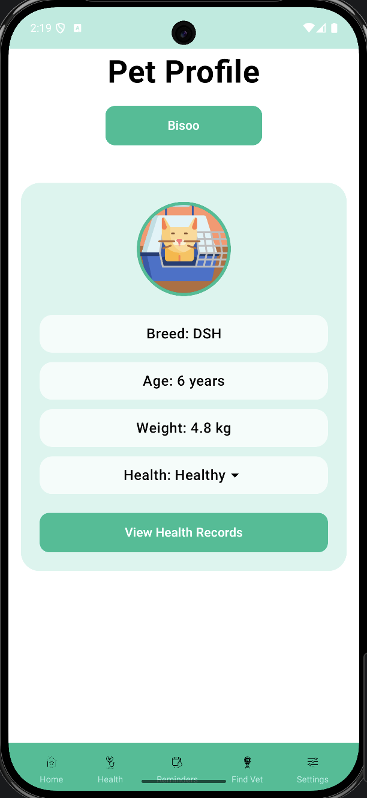
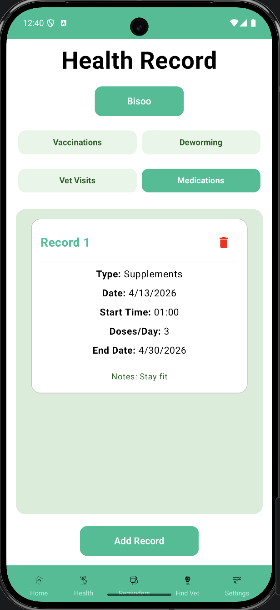
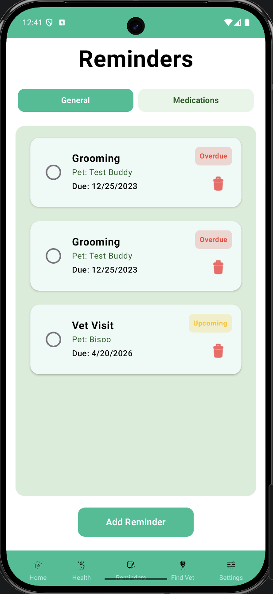
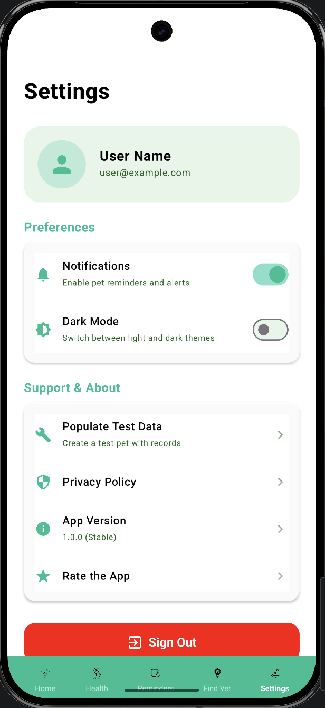

# PetSync 🐾

## 🚀 Full-Featured Mobile Pet Management Application
**PetSync** is a modern, comprehensive pet health and lifestyle management application built for Android. It helps pet owners keep track of their furry friends' medical records, vaccinations, medications, and daily routines through an intuitive and beautiful interface. Developed as a final year diploma project and continuously improved beyond coursework.

---

## ✨ Features

- **🐕 Pet Profiles:** Create and manage detailed profiles for all your pets, including their breed, age, weight, and health status.
- **🏥 Health Tracker:** A consolidated health record system to log vaccinations, deworming, vet visits, and more.
- **⏰ Reminder System:** Create and manage reminders for medications, vet visits, and general tasks with clear status tracking (incomplete, completed, overdue).
- **🔄 Real-time Sync:** Powered by Firebase Firestore, your data stays in sync across devices instantly.
- **🎨 Modern UI/UX:** Built entirely with Jetpack Compose and Material 3, featuring a clean "Green-tone" theme with full Dark Mode support.
- **🔒 Secure Auth:** Firebase-powered authentication for secure sign-ups and profile management.
- **📂 Cloud Storage:** Safely store pet photos using Firebase Storage.

---

## 🔥 Key Highlights

- Built as a final year diploma project and continuously improved post-completion
- Supports multi-user and multi-pet data management
- Real-time synchronization using Firebase Firestore
- Clean MVVM architecture with reactive StateFlow
- Designed as a scalable, real-world mobile application

---

## 🛠️ Tech Stack

- **Language:** [Kotlin](https://kotlinlang.org/)
- **UI Framework:** [Jetpack Compose](https://developer.android.com/jetpack/compose)
- **Architecture:** MVVM (Model-View-ViewModel)
- **Database:** [Firebase Firestore](https://firebase.google.com/docs/firestore)
- **Authentication:** [Firebase Auth](https://firebase.google.com/docs/auth)
- **Image Loading:** [Coil](https://coil-kt.github.io/coil/)
- **Background Tasks:** [AlarmManager](https://developer.android.com/training/scheduling/alarms) for precise notifications.
- **Dependency:** Material 3, Navigation Compose, Coroutines, Flow.

---

## 📸 Screenshots & Demo

<details>
<summary><b>Click to expand app screenshots</b></summary>

<div style="text-align: center;">
  
  
</div>

<div style="text-align: center;">
  
  
</div>

</details>

---

## 🏗️ Architecture & Data Structure

The app follows a scalable MVVM architecture with a structured Firestore database design optimized for real-time data handling and efficient querying.

### Firestore Schema Optimization
Recently refactored to a more efficient, flat hierarchy:
- `users/` - User profile data (name, email).
- `pets/` - Top-level collection for all pets.
    - `pets/{petId}/health_records` - Consolidated sub-collection for all medical events (Category-based filtering).
    - `pets/{petId}/reminders` - Pet-specific reminders.

*Used **Firestore Collection Groups** for efficient querying of all reminders across multiple pets.*

---

## 🚀 Getting Started

### Prerequisites
- Android Studio Iguana or newer.
- A Firebase project.

### Setup
1. **Clone the repository:**
   ```bash
   git clone https://github.com/Turkishangoras/PetSync.git
   ```
2. **Add Firebase:**
   - Create a project in the [Firebase Console](https://console.firebase.google.com/).
   - Add an Android app with the package name `com.example.petsync1`.
   - Download `google-services.json` and place it in the `app/` directory.
   - Enable **Email/Password Authentication**, **Firestore**, and **Firebase Storage**.
3. **Build & Run:**
   - Sync the project with Gradle files.
   - Run the app on an emulator or physical device.

---

## 🧪 Testing and Data Flow
To verify the app's functionality and its integration with Firebase:

### 1. Manual Data Entry (End-to-End Test)
You can test the full lifecycle of the app by:
1. **Creating an account** via the Sign-Up screen.
2. **Adding a Pet** with a name, breed, and photo.
3. **Logging Health Records** (Vaccinations, Vet Visits) and **Reminders**.
4. Verifying that all data is instantly synced to **Firestore** and reflected in real-time across the Home, Health Tracker, and Reminders screens.

### 2. Quick-Populate Test Data
If you'd like to see how the app handles multiple entries instantly:
1. Go to the **Settings** screen.
2. Tap **"Populate Test Data"**.
3. This will programmatically create a sample pet with pre-filled health records and reminders, demonstrating the app's data grouping and real-time observer logic.

---

## 📄 License
This project is licensed under the MIT License - see the [LICENSE](LICENSE) file for details.

---

## 👨‍💻 Author
**Ali Nawwaf Fathuhy** - [Turkishangoras](https://github.com/Turkishangoras)

*Made with ❤️ for pet lovers.*
